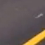
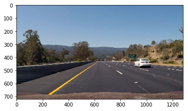
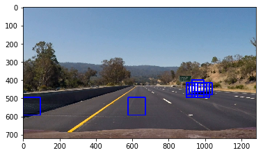
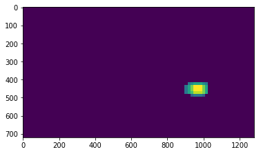
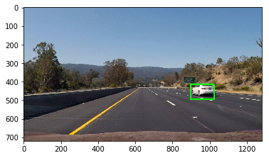

## Writeup Template
### You can use this file as a template for your writeup if you want to submit it as a markdown file, but feel free to use some other method and submit a pdf if you prefer.

---

**Vehicle Detection Project**

[Video output](https://youtu.be/EtS9RD13cXU)

The goals / steps of this project are the following:

* Perform a Histogram of Oriented Gradients (HOG) feature extraction on a labeled training set of images and train a classifier Linear SVM classifier
* Optionally, you can also apply a color transform and append binned color features, as well as histograms of color, to your HOG feature vector. 
* Implement a sliding-window technique and use your trained classifier to search for vehicles in images.
* Run your pipeline on a video stream (start with the test_video.mp4 and later implement on full project_video.mp4) and create a heat map of recurring detections frame by frame to reject outliers and follow detected vehicles.
* Estimate a bounding box for vehicles detected.


## [Rubric](https://review.udacity.com/#!/rubrics/513/view) Points
### Here I will consider the rubric points individually and describe how I addressed each point in my implementation.  

---
### Writeup / README

#### 1. Provide a Writeup / README that includes all the rubric points and how you addressed each one. 

You're reading it!

### Histogram of Oriented Gradients (HOG)

#### 1. Explain how (and identify where in your code) you extracted HOG features from the training images.

I used the video to augment the dataset with more images of frames that weren't vehicles. [This notebook](part_0_augment_dataset.ipynb) contains the info

I started by reading in all the `vehicle` and `non-vehicle` images.  Here is an example of one of each of the `vehicle` and `non-vehicle` classes:

 


In [this notebook](part_1_building_the_classifier.ipynb) I tried building different classifiers. The `extract_features` method in `lesson_functions.py` is where I extract the different features.

#### 2. Explain how you settled on your final choice of HOG parameters.

I tried various combinations of parameters:
```
options = [
    {'color_space': 'HLS', 'hog_feat' : True, 'hog_channel' : 'ALL', 'hist_feat' : True},
    {'color_space': 'HSV', 'hog_feat' : True, 'hog_channel' : 'ALL', 'hist_feat' : True},
    {'color_space': 'HSV', 'hog_feat' : True, 'hog_channel': 'ALL', 'hist_feat' : False},
    {'color_space': 'YUV', 'hog_feat' : True, 'hog_channel': 'ALL', 'hist_feat' : False},
]

# I didn't vary the following options
static_options = {
    'orient': 9,
    'spatial_size': (16, 16),
    'hist_bins': 16,
    'hist_feat': True,
    'spatial_feat': True,
    'pix_per_cell': 8, 
    'cell_per_block': 2}
    
 ```

I eventually settled with 
```
{'cell_per_block': 2,
 'color_space': 'HLS',
 'hist_bins': 16,
 'hist_feat': True,
 'hog_channel': 'ALL',
 'hog_feat': True,
 'orient': 9,
 'pix_per_cell': 8,
 'spatial_feat': True,
 'spatial_size': [16, 16],
 'test_accuracy': 0.9893,
  'hog_feat': True}]
```

as it had a test accuracy of 98.9 %.

#### 3. Describe how (and identify where in your code) you trained a classifier using your selected HOG features (and color features if you used them).

Cell 50 in [this notebook](part_1_building_the_classifier.ipynb) is where I trained an SVM to predict whether a cell has vehicles on not.

### Sliding Window Search

#### 1. Describe how (and identify where in your code) you implemented a sliding window search.  How did you decide what scales to search and how much to overlap windows?

In [part_2_video_processing.ipynb](part_2_video_processing.ipynb), the following two lines perform the sliding window search

```
current_windows = current_windows + find_cars(image, predictor, scale=1.5, overlap=0.5)
current_windows = current_windows + find_cars(image, predictor, scale=1, overlap=0.7)
```
I use the `find_cars` function in `feature_extraction.py` to extract features to score the SVM model for each cell in the sliding window. I used two window sizes (scales 1.5 and 1) with an overlap of 0.5 and 0.7 respectively. I ended up with this set of params after quite a bit of experimentation.

#### 2. Show some examples of test images to demonstrate how your pipeline is working.  What did you do to optimize the performance of your classifier?

Raw image ...



After sliding window search ...



Applying a thresholded heatmap ...



And finally, the bounding box !



### Video Implementation

#### 1. Provide a link to your final video output. 

Here's a [link to my video result](https://youtu.be/EtS9RD13cXU)


#### 2. Describe how (and identify where in your code) you implemented some kind of filter for false positives and some method for combining overlapping bounding boxes.

Here are the techniques I used to remove false positives as well as to smooth the bounding boxes while processing the video

* Ignore really tiny / weirdly proportioned bounding boxes. (`draw_labeled_bboxes` method in `lesson_functions.py`)

* Add additional weight to bounding boxes found near previously identified bounding boxes

* Keep track of the heatmap over the last 12 frames (and draw a bounding box on the sum of this)

* Process only 1 in 3 frames. This removed false positives from static objects, as well as made the processing 3 x faster

---

### Discussion

#### 1. Briefly discuss any problems / issues you faced in your implementation of this project.  Where will your pipeline likely fail?  What could you do to make it more robust?

* Removing false positives was the biggest hurdle in this project. While the parameters I've used seem to work well in this case, I'm not sure what will happen with changes in lighting, changes to the road surface etc. 

* Fast processing of the video was also an issue. While I got around it by processing 1 in 3 frames without losing accuracy, some sort of multithreaded implementation will be useful to process videos in realtime

* I'd love to build an ensemble of predictors using classical techniques (like we saw in this project) as well as YOLO - type models
